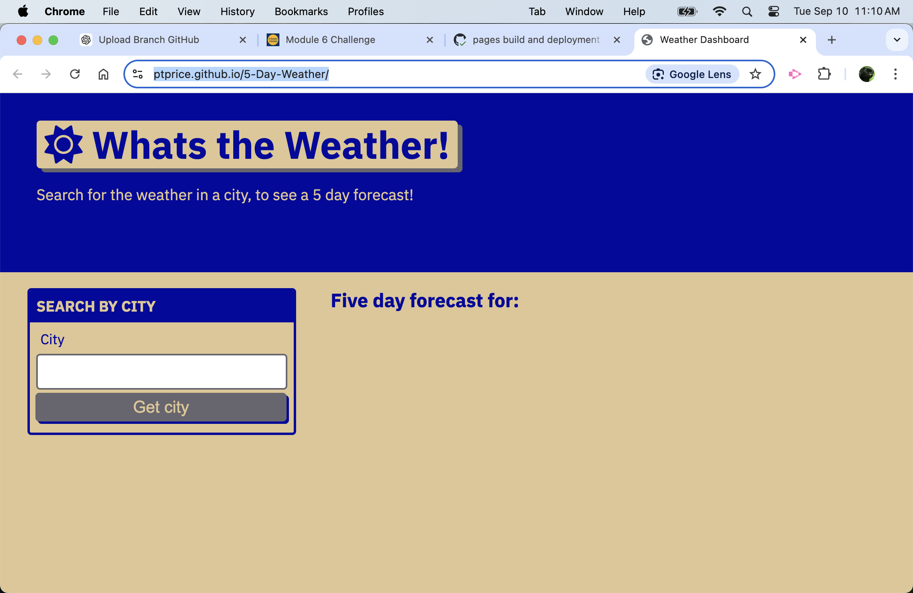
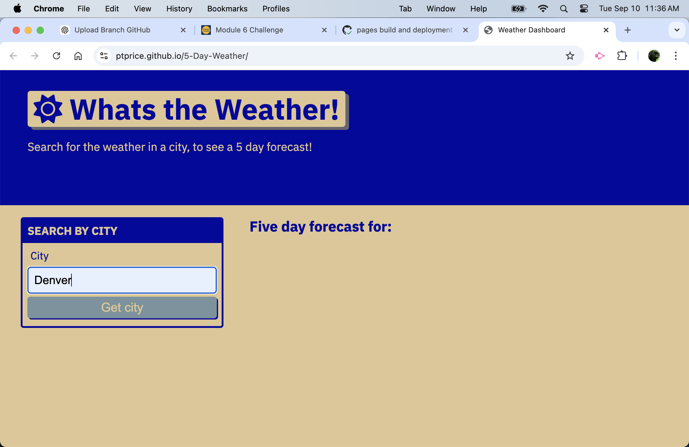
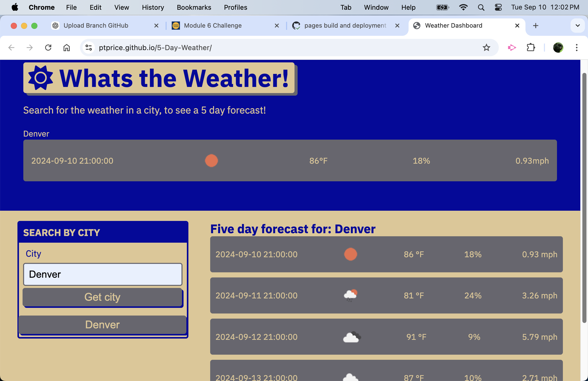
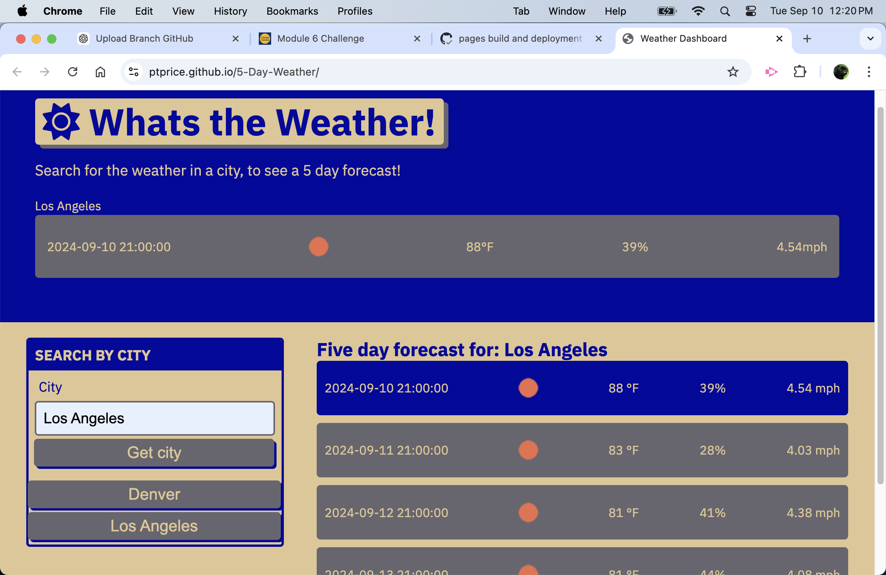

# Project Title

5 Day Weather App

## Description

The 5 Day Weather App is a dashboard for finding the current weather and 5 day forcast for a location provided by the user. 

## Getting Started

### Dependencies

There are no package/library/framework dependencies for this application. 

### Installing

Nothing needs to be installed just go to the https://ptprice.github.io/5-Day-Weather/ website.

### Executing program

Users go to the website listed above.
<br>

<br>
<br>
Users enter a name of a city which will be translated to coordinates by the app. Then the user clicks the "Get City" button. 
<br>
<br>

<br>
<br>
The website will return the weather information. 
<br>
<br>

<br>
<br>
The user can now select a new city and toggle between them using the buttons with the city names. 
<br>
<br>

<br>
<br>

```

## Help

For any problems or issues please contact the author using the email below. 

## Authors

Contributors names and contact info

Paul Price
ptprice@gmail.com

## Version History
* 0.3
    Added screenshots to the Readme file
* 0.2
    Added readme file and updated the homepage.js file to correct an error
* 0.1
    Initial upload

## License

This project is licensed under the MIT License

)